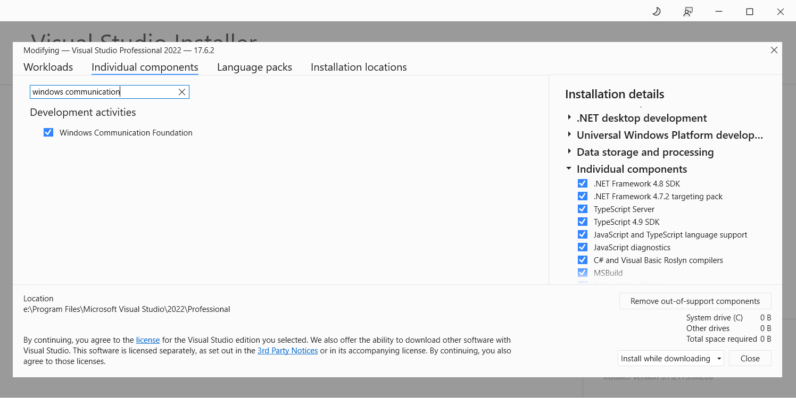
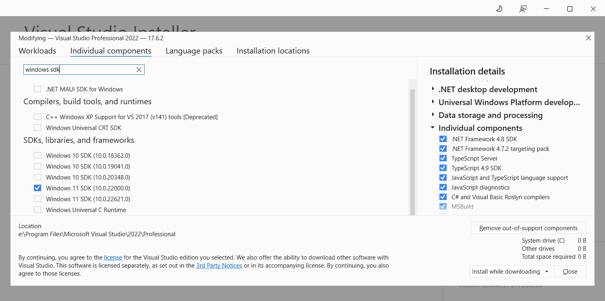
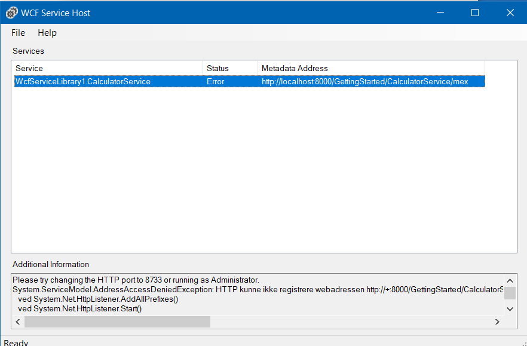

# Windows Communication Foundation (WCF) sample project

This project has been setup based on the guide: https://docs.microsoft.com/en-us/dotnet/framework/wcf/getting-started-tutorial

It serves as a starting point for WCF projects. It can be used to test establishing a simple connection and trying out different configurations. 


## Prerequisites

- Visual studio. I used Visual studio 2022, but other versions should work as well.

- Visual studio feature "Windows Communication Foundation" must be installed.

Open Windows settings > Programs & features > Visual studio > Modify > Individual components > Windows Communication Foundation



- .NET Framework 4.6.2. (Windows settings > Programs & features > Visual studio > Modify > Individual components)

- Windows SDK must be installed. I have Windows 11 SDK, but others can be used as well. This contains SvcUtil.exe that is used to generate proxy code. Path to SvcUtil for Windows 11 SDK: c:\Program Files (x86)\Microsoft SDKs\Windows\v10.0A\bin\NETFX 4.6.2 Tools\SvcUtil.exe




## Configuration

During the step "Create a client" when generating the proxy class file, the svcutil.exe can be invoked like this from command prompt (cmd) (When using Windows 11 SDK and .NET Framework 4.6.2) 

```cmd
"c:\Program Files (x86)\Microsoft SDKs\Windows\v10.0A\bin\NETFX 4.6.2 Tools\SvcUtil.exe" /language:cs /out:generatedProxy.cs /config:app.config http://localhost:8000/GettingStarted/CalculatorService
```


## Debugging

- Start Visual studio as administrator. 

- Set GettingStartedClient as startup project. 

- Set breakpoint in GettingStartedLib/Service1.cs. 

- Hit F5 to debug


## Known issues

Exception: "There was no endpoint listening at  http://localhost:8000/GettingStarted/CalculatorService that could accept the message. This is often caused by an incorrect address or SOAP action. See InnerException, if present, for more details."

WCF Service host shows following error message: 



Reason: Visual studio needs to be started in administrator mode.


## References

[Tutorial: Get started with Windows Communication Foundation applications](https://docs.microsoft.com/en-us/dotnet/framework/wcf/getting-started-tutorial)


## Todo

Investigate if we can setup the project using devcontainers with the following image:

https://hub.docker.com/_/microsoft-dotnet-framework-wcf/